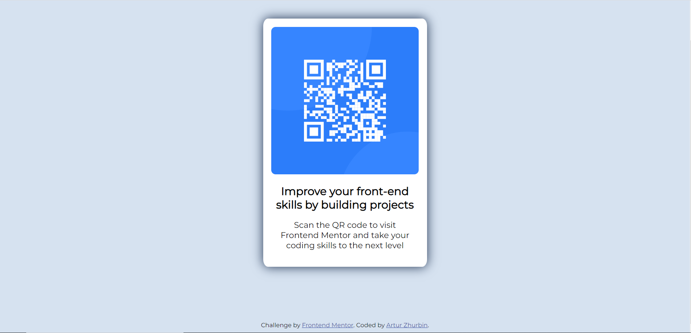

# Frontend Mentor - QR code component solution

This is a solution to the [QR code component challenge on Frontend Mentor](https://www.frontendmentor.io/challenges/qr-code-component-iux_sIO_H). Frontend Mentor challenges help you improve your coding skills by building realistic projects.

## Table of contents

- [Overview](#overview)
  - [Screenshot](#screenshot)
  - [Links](#links)
- [My process](#my-process)
  - [Built with](#built-with)
  - [What I learned](#what-i-learned)
  - [Continued development](#continued-development)
  - [Useful resources](#useful-resources)
- [Author](#author)

## Overview

This was my first challenge. Here I've designed a layout for that QR code as it was shown in the preview. I've made a bit more obvious shadow though and didn't add any media queries since the design wasn't different between desktop and mobile versions.

### Screenshot



### Links

- Solution URL: [Add solution URL here](https://your-solution-url.com)
- Live Site URL: [Add live site URL here](https://your-live-site-url.com)

## My process

At the beginning I've put all the elements (except for "Challenge by frontend mentor...") in one container, so that I can move all of that information in a center of the viewport, I adjusted the sizes for the container, set the background colors for container and the viewport itself. As next, I have aligned the content in container (set margins, paddings), changed font-family, font-size. Then I've modified border-radius to get rid of sharp edges and set a shadow to the container and voila, here is the result!

### Built with

- Semantic HTML5 markup
- CSS custom properties

### What I learned

I've strengthen my HTML and CSS knowledge that I've got from online courses from Udemy and Code With Mosh and by reading mdn, w3school articles. Also, I learned how to implement another font family in my code.

```html
<link rel="preconnect" href="https://fonts.googleapis.com" />
<link rel="preconnect" href="https://fonts.gstatic.com" crossorigin />
<link
  href="https://fonts.googleapis.com/css2?family=Merriweather&family=Montserrat&family=Sacramento&display=swap"
  rel="stylesheet"
/>
```

```css
body {
  font-family: "Montserrat", sans-serif;
}
```

### Continued development

I would like to work more on positioning elements since I don't have much experience yet. In general I want to practice more how to create a pregiven layouts, to master new things that I wouldn't think of if I would build my own layouts

### Useful resources

- [Example resource 1](https://developer.mozilla.org/en-US/docs/Web/CSS/border-radius) - This helped me to create round corners for my container.

## Author

- Frontend Mentor - [@arturix2209](https://www.frontendmentor.io/profile/arturix2209)
